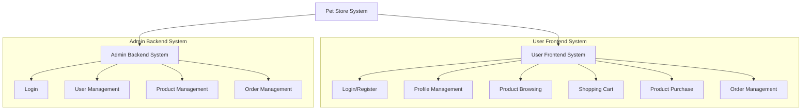
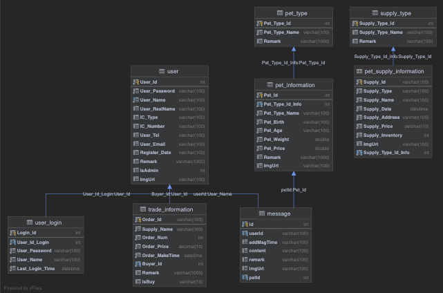
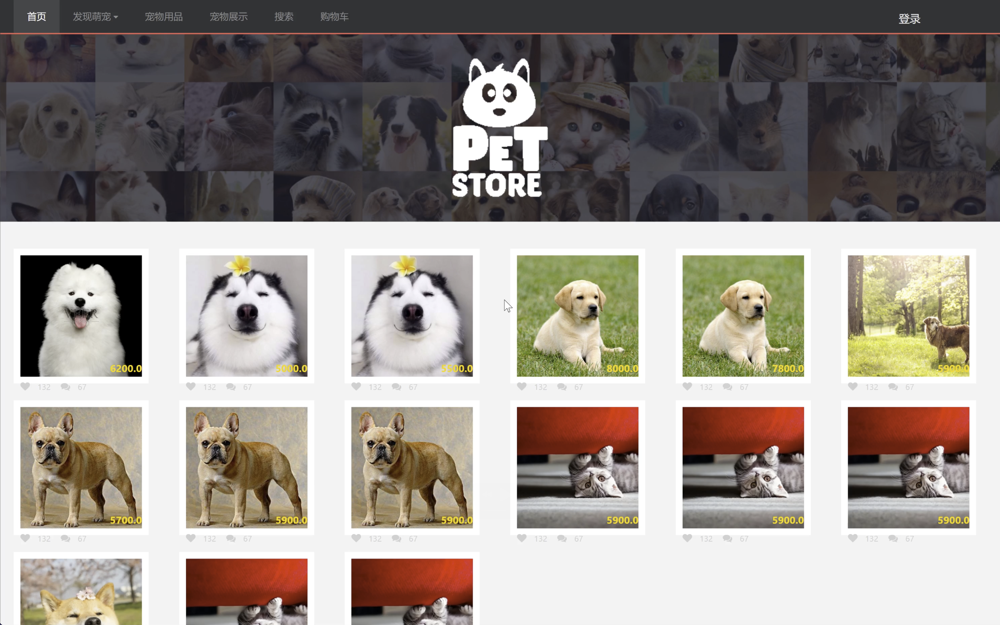
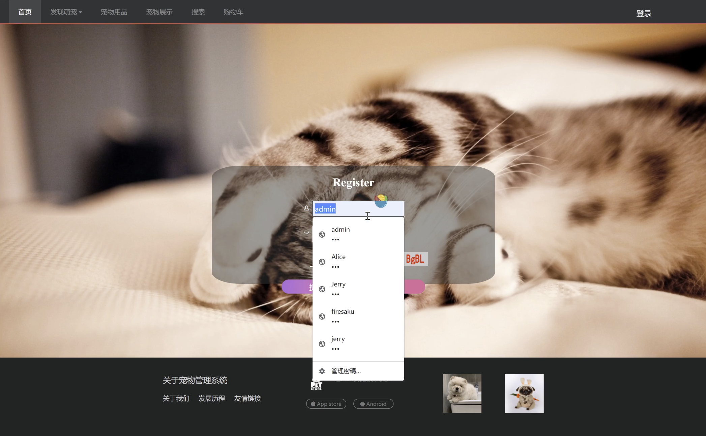
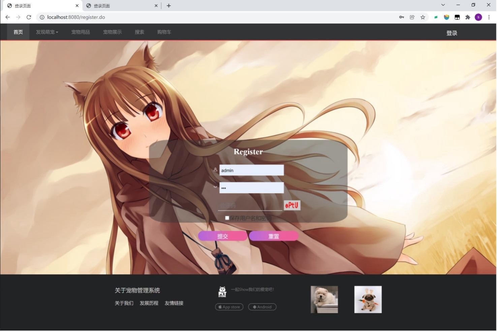
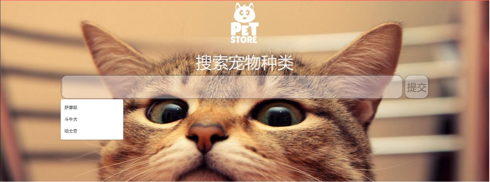
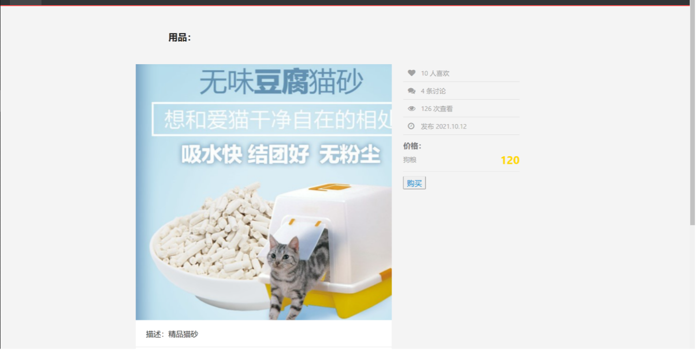
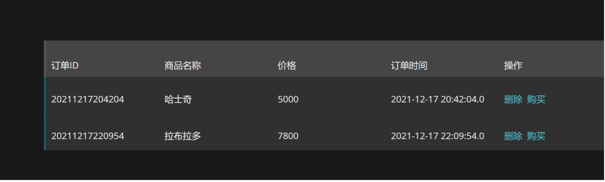
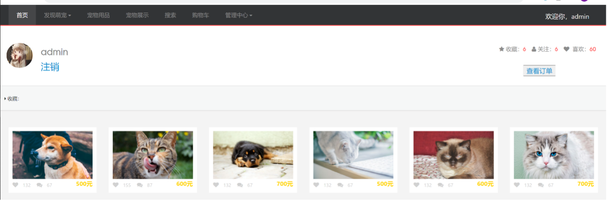
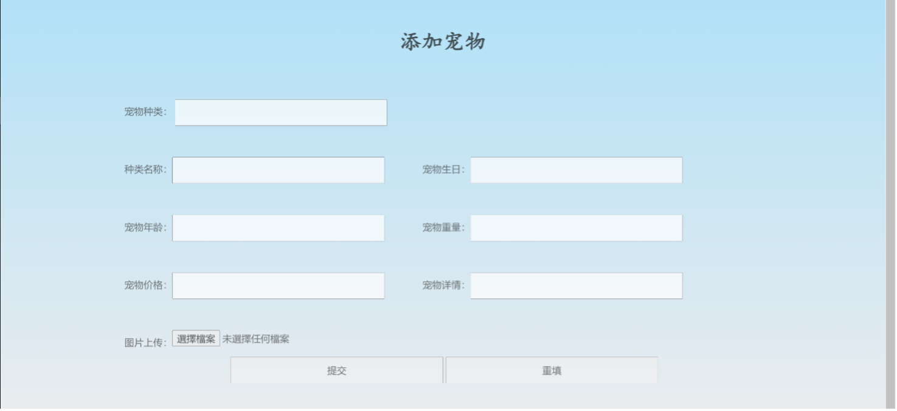

# PetStore — E-commerce Pet Shop (Spring Boot + Thymeleaf)

This repository contains a course/final-project style e-commerce pet store built with Spring Boot, Spring Data JPA and Thymeleaf. The purpose of the repo is to be a clear, presentable demo of a typical Java web application — suitable for browsing on GitHub.

Note: This project was built before AI-assisted UI design became common, so the interface is simple compared to modern AI-designed UIs, but the functionality is complete.

This README is written to help a reader understand the project structure, how to run it for local demo purposes, and how to prepare the repo for sharing on GitHub.

## Highlights

- Java: 11
- Build: Maven (project includes `mvnw` wrapper, but note: some wrapper files may be missing in this copy — using the system `mvn` is fine)
- Default DB: MySQL (see `src/main/resources/application.yml`)
- Local demo: a `local` Spring profile is provided which uses an in-memory H2 database (`src/main/resources/application-local.yml`)


## Important: `mvnw` (Maven Wrapper) — what it is and what to do

`mvnw` is the Maven Wrapper script. It allows someone to build the project with a stable Maven version without installing Maven system-wide. A complete wrapper includes:

- `mvnw` (Unix shell script), `mvnw.cmd` (Windows), and the `.mvn/wrapper` directory containing `maven-wrapper.jar` and `maven-wrapper.properties`.

If the wrapper files are missing (for example, `.mvn/wrapper/maven-wrapper.jar`), the wrapper will fail. In that case either:

- Install Maven on your machine and run `mvn ...` commands, or
- Restore the missing wrapper files (often simplest: run `mvn -N io.takari:maven:wrapper` on a machine that has Maven).

This repository includes `mvnw` but some wrapper artifacts were incomplete in the copy I received — using the system `mvn` is the easiest approach.


## Run the project locally (quick demo using H2)

Prerequisites (only if you plan to run):

- JDK 11 installed (OpenJDK or Oracle JDK)
- Maven installed (system `mvn`) — only required if the wrapper is incomplete

Steps to run with the in-memory demo profile:

```bash
cd /path/to/pet_store/pet_store
# If wrapper is available and complete, you can use ./mvnw; otherwise use system mvn
mvn spring-boot:run -Dspring-boot.run.profiles=local
```

After startup:

- Application: http://localhost:8080
- H2 console: http://localhost:8080/h2-console
  - JDBC URL: `jdbc:h2:mem:petdb`
  - Username: `sa`  (password: leave empty)

To create an executable JAR for distribution:

```bash
mvn -DskipTests package
java -jar target/PetStore-0.0.1-SNAPSHOT.jar --spring.profiles.active=local
```

## Run with MySQL (production-like)

1. Create the `pet_store` database and a user in MySQL. Example SQL:

```sql
CREATE DATABASE pet_store CHARACTER SET utf8mb4 COLLATE utf8mb4_unicode_ci;
CREATE USER 'petuser'@'localhost' IDENTIFIED BY 'yourpassword';
GRANT ALL PRIVILEGES ON pet_store.* TO 'petuser'@'localhost';
FLUSH PRIVILEGES;
```

2. Update `src/main/resources/application.yml` `spring.datasource.url`, `username`, and `password` (or set the equivalent environment variables `SPRING_DATASOURCE_*`).

3. Run without the `local` profile:

```bash
mvn spring-boot:run
```

## Project layout (short)

- `src/main/java/.../petstore` — controllers, services, DAOs, entities
- `src/main/resources/templates` — Thymeleaf templates
- `src/main/resources/static` — CSS/JS/images used by templates
- `pom.xml` — Maven build file

## System Architecture



## Features

The system is primarily divided into two main functional modules: a user-facing frontend and an administrative backend.

### Frontend Features

1. **Login/Register:** Users can register for an account and log in.
2. **Profile Management:** Users can modify their personal information.
3. **Product Browsing:** Includes features for product search and browsing by category.
4. **Shopping Cart:** Users can add products to the shopping cart and purchase items from it.
5. **Product Purchase:** Users can proceed with the purchase of products.
6. **Order Management:** Users can delete their own orders.

### Backend (Admin) Features

1. **Login:** Administrators can log in to the admin panel to manage the system.
2. **User Management:** Administrators can perform CRUD (Create, Read, Update, Delete) operations on user accounts.
3. **Product Management:** Includes management of pets and pet supplies, with full CRUD functionality for these items.
4. **Order Management:** Administrators can perform CRUD operations on all orders in the system.

## Database ER Model



This is the database ER model diagram.

## Program Preview (UI in Chinese)

The screenshots below show the core user experience. The interface text is in Chinese, so English captions are provided for clarity.

### Home Page



### Login



### Register



### Search & Browse Products



### Product Detail



### Shopping Cart



### User Profile



### Admin: Add Pet/Product



